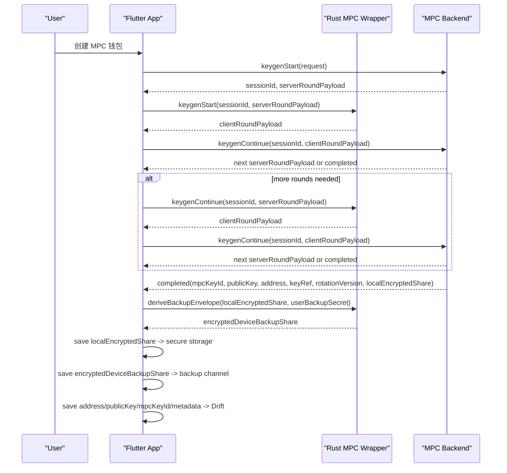
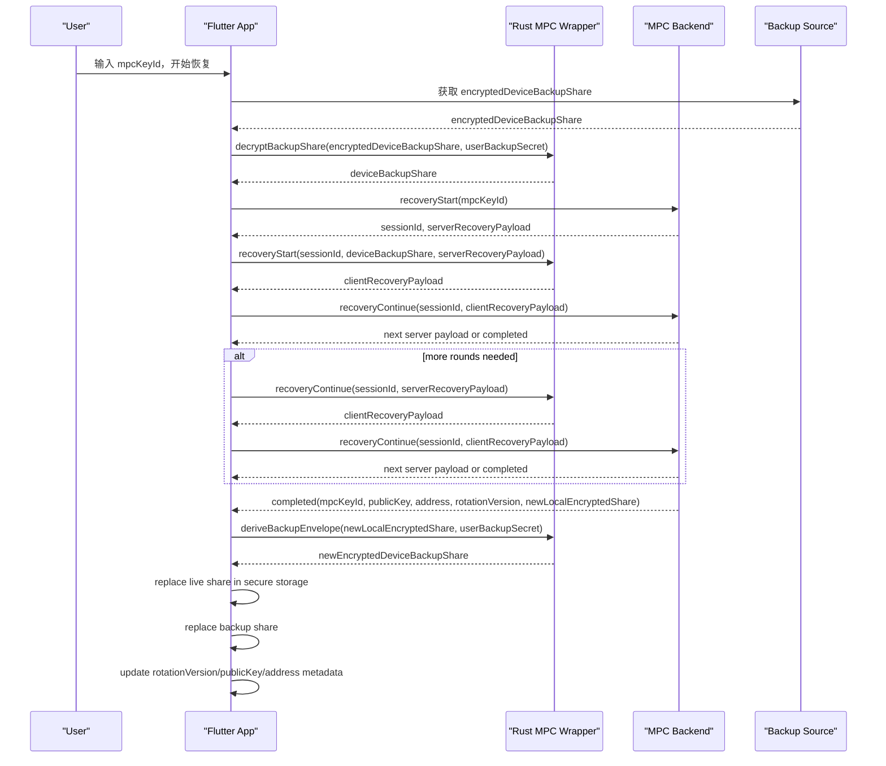
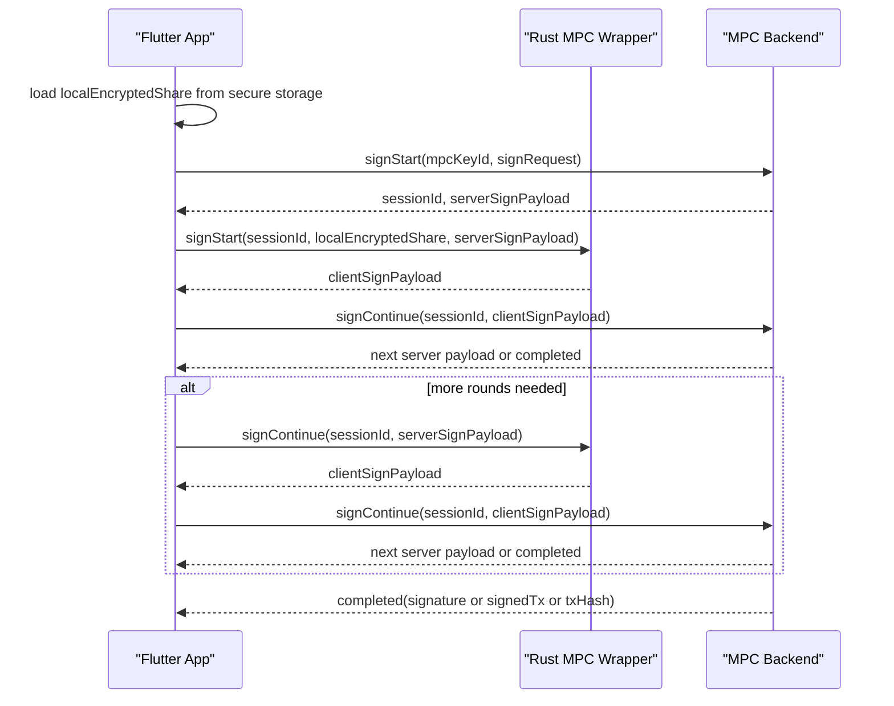

# 钱包能力补全与状态治理实施清单（ceres_wallet）

> 说明：本清单在原 MPC 接入清单基础上升级为第二阶段执行版。
> - 第一阶段（MPC-001 ~ MPC-022）已完成。
> - 本阶段聚焦你提出的 4 个方向：WalletConnect v2、NFT、多签钱包、全局状态迁移到 flutter_riverpod。

## 0. 当前 MPC 真实化选型

### 0.1 选型结论
- 当前真实 MPC 重构主线统一采用 `ZenGo-X/kms-secp256k1` 作为前后端密码学底座。
- 不采用 `Fireblocks/mpc-lib` 作为当前主线执行基座；其仅保留为备选参考。
- 不采用 `bnb-chain/tss-lib` 与 `mpcium` 作为当前钱包主线方案。

### 0.2 目标 share 模型
- `deviceLiveShare`
  - 当前设备日常签名使用的 live share
- `encryptedDeviceBackupShare`
  - 由客户端生成并再次加密后的 backup share，用于换机/恢复
- `serverShare`
  - 服务端持有的 share

签名模型：
- `deviceLiveShare + serverShare`

恢复模型：
- `encryptedDeviceBackupShare + serverShare`

恢复成功后：
- 必须轮换出新的三份 share
- 地址保持不变
- `rotationVersion` 递增

### 0.3 客户端/服务端/数据库边界
- Flutter 客户端：
  - 负责 keygen/recovery/sign 会话编排
  - 负责保存 `deviceLiveShare`
  - 负责导出/备份 `encryptedDeviceBackupShare`
  - 不再把任何 MPC share 复用到 `privateKey` 语义
- 服务端：
  - 基于 `ZenGo-X/kms-secp256k1` 执行真实 keygen/recovery/sign/rotation
  - 持有 `serverShare`
- Drift 数据库：
  - 只保存 `mpcKeyId/address/publicKey/curve/threshold/keyRef/backupState/rotationVersion/mpcMetadata`
  - 不保存 `deviceLiveShare`
  - 不保存 `encryptedDeviceBackupShare`
  - 不保存完整私钥

### 0.4 当前阶段交付顺序
1. Phase 6：真实 keygen/recovery 接入
2. Phase 7：真实 sign 主流程闭环
3. Phase 8：backup share / rotation / recovery UX / 回归门禁

### 0.5 在线参与方与地址生成原则
- 当前三份 share 模型中，在线协议参与方先收敛为两方：
  - 设备 live share
  - 服务端 share
- backup share 不作为日常在线签名参与方，而是恢复材料。
- 地址不是由三份 share “直接拼出来”，而是由 keygen 协议共同产出的 `group public key` 推导得到。
- 客户端可以基于 `publicKey` 本地校验地址，但最终以协议完成后返回的 `address/publicKey` 为准。

### 0.6 创建 / 恢复 / 签名时序图

#### 创建


#### 恢复


#### 签名


### 0.7 接口字段草案

#### keygen/recovery/sign start 响应
```json
{
  "requestId": "req_xxx",
  "sessionId": "sess_xxx",
  "round": 1,
  "status": "continue",
  "serverPayload": "base64-or-json"
}
```

#### continue 请求
```json
{
  "sessionId": "sess_xxx",
  "round": 1,
  "clientPayload": "base64-or-json"
}
```

#### keygen / recovery 成功响应
```json
{
  "status": "completed",
  "mpcKeyId": "key_xxx",
  "address": "0x...",
  "publicKey": "02...",
  "curve": "secp256k1",
  "threshold": 2,
  "keyRef": "ref_xxx",
  "backupState": "pending",
  "rotationVersion": 1,
  "localEncryptedShare": "opaque-live-share-blob",
  "encryptedBackupShare": "opaque-backup-share-envelope"
}
```

#### sign 成功响应
```json
{
  "status": "completed",
  "signature": "0x...",
  "signedTx": "0x...",
  "txHash": "0x..."
}
```

## 1. 目标与范围

### 1.1 目标
在不破坏现有 SDK 对外兼容与主流程稳定性的前提下，补全高优先级缺口能力并统一状态管理架构。

### 1.2 本阶段范围（Phase-2）
- WalletConnect v2 功能补全（会话、签名、交易、链切换、回调）
- NFT 功能补全（数据、展示、发送、记录）
- 多签钱包功能补全（入口、状态机、签名流）
- 状态管理统一迁移到 `flutter_riverpod`

### 1.3 非目标（本阶段）
- 不新增交易业务线（如理财、衍生品）
- 不做 UI 大改版
- 不做与安全目标无关的大规模重构

## 2. 当前代码基线（本阶段相关）

- WalletConnect 页面与路由：`lib/ui/wallet_connect/web_connect_page.dart`、`lib/router.dart`
- NFT 详情页：`lib/ui/home/nft_info_page.dart`
- 多签入口：`lib/router.dart`（多签路由当前注释）
- 状态管理混用：`provider + hooks + riverpod + ChangeNotifier`

结论：能力存在“部分实现 + 入口不完整 + 状态层混杂”问题，需按域分批治理。

## 3. 工作分解（WBS）

## A. WalletConnect v2 功能补全
- `WC2-001` 现状盘点与协议能力矩阵（methods/events/chains）
- `WC2-002` 会话生命周期补全（connect/approve/reject/disconnect/restore）
- `WC2-003` 签名能力补全（personal_sign / eth_signTypedData_v4）
- `WC2-004` 交易能力补全（eth_sendTransaction + 交易确认）
- `WC2-005` 链切换与 namespace 约束（含不支持链的降级）
- `WC2-006` SDK 回调与错误码统一（可观测）
- `WC2-007` 回归与联调样例（至少 2 个主流 dApp）

WC2-001 当前输出文档：
- `doc/research/wc2_capability_matrix_v1.md`

WC2-002 当前进展（已完成）：
- `lib/data/remote/wallet_connect_ws.dart` 已补充连接生命周期事件流（connecting/connected/approved/rejected/disconnected/error）
- `lib/data/remote/wallet_connect_session_storage.dart` 新增统一会话持久化读写
- `lib/ui/wallet_connect/web_connect_page.dart` 已改为复用统一会话存储服务
- `lib/ui/wallet_connect/web_connect_page.dart` 已支持无入参场景自动从本地恢复会话 URI
- `lib/ui/wallet_connect/web_connect_page.dart` 页面销毁不再强制清空会话，主动断开才清理
- `lib/data/remote/wallet_connect_ws.dart` 已补充消息解析容错与 peerId 缺失保护
- `lib/ui/wallet_connect/web_connect_page.dart` 已补无效 URI/建连异常保护，失败可读化提示

WC2-003 当前进展（已完成）：
- 目标链路：`personal_sign` / `eth_signTypedData_v4`
- 当前策略：先在既有 WC 页面恢复签名确认与回包主路径，保持 UI 不变
- `lib/ui/wallet_connect/web_connect_page.dart` 已恢复 `personal_sign / eth_sign / eth_signTypedData(_v4)` 的签名与回包主路径
- `lib/data/remote/wallet_connect_request_parser.dart` 新增签名参数解析器，已修复 `personal_sign` 参数顺序兼容问题
- `test/wallet_connect_request_parser_test.dart` 已新增签名参数解析单测（`personal_sign/eth_sign/typedData_v4`）

WC2-004 当前进展（已完成）：
- `lib/ui/wallet_connect/web_connect_page.dart` 已恢复 `eth_sendTransaction` 的确认、签名发送与回包主路径
- `lib/ui/wallet_connect/web_connect_page.dart` 已补交易发送 loading 关闭与异常回包保护
- `lib/data/remote/wallet_connect_request_parser.dart` 已增加交易参数合法性校验（`to` 地址缺失即拒绝）

WC2-005 当前进展（已完成）：
- `lib/ui/wallet_connect/web_connect_page.dart` 已补 `wallet_switchEthereumChain` / `wallet_addEthereumChain` 处理
- 当前策略：仅允许当前链 ID，非当前链统一返回可读降级错误
- `lib/data/remote/wallet_connect_request_parser.dart` 已补切链参数解析
- `lib/ui/wallet_connect/web_connect_page.dart` 已补未支持 method 统一降级返回（避免请求悬挂）
- `test/wallet_connect_request_parser_test.dart` 已补十进制/大写十六进制链 ID 解析回归

WC2-006 当前进展（已完成）：
- 新增 `lib/src/api/wallet_connect_observer.dart`，统一对外暴露 WC 事件流与错误码
- `lib/ui/wallet_connect/web_connect_page.dart` 已接入统一事件上报（连接态/请求通过/请求拒绝）
- `lib/ceres_wallet.dart` 已导出 WC 观测 API，宿主可直接订阅
- `example/lib/main.dart` 已接入 WC 事件订阅与最新事件展示（宿主联调样例）

WC2-007 当前进展（进行中）：
- 新增 `doc/research/wc2_regression_report_v1.md`，覆盖 Uniswap/OpenSea 双 dApp 的主路径/失败路径回归点
- 已纳入 `wallet_switchEthereumChain` 非当前链降级验证点与宿主事件验证点

## B. NFT 功能补全
- `NFT-001` NFT 数据模型与链适配清单（ERC-721/1155）
- `NFT-002` NFT 列表拉取/缓存/分页补全
- `NFT-003` NFT 详情页容错与元数据展示增强
- `NFT-004` NFT 发送流程落地（当前按钮未执行）
- `NFT-005` NFT 交易记录映射与状态展示
- `NFT-006` NFT 发送签名确认与风险提示统一
- `NFT-007` NFT 功能回归用例（成功/失败路径）

NFT-001 当前输出文档：
- `doc/research/nft_model_chain_adaptation_matrix_v1.md`

## C. 多签钱包功能补全
- `MS-001` 恢复多签路由与入口可达性
- `MS-002` 多签账户模型与普通账户共存治理
- `MS-003` 多签交易创建/签名/广播流程闭环
- `MS-004` 多签交易状态机（待签名/已签名/已执行/失败）
- `MS-005` 多签二维码协作与外部签名流程修复
- `MS-006` 多签与 WC2 兼容矩阵与限制策略
- `MS-007` 多签 UAT 场景回归（2/3, 3/5）

MS-001 当前进展（已完成）：
- `lib/ui/setting/wallet_manager/wallet_manager_page.dart` 已加入口防崩溃兜底（未恢复路由时给出可读提示）
- `lib/router.dart` 已补多签相关缺失路由占位页（避免 pushNamed 崩溃）

## D. 全局状态迁移到 flutter_riverpod
- `RVP-001` 全量状态盘点与迁移地图（模块->负责人->顺序）
- `RVP-002` 统一 Provider 分层设计（App/Feature/Infra）
- `RVP-003` 基础依赖注入迁移（service/repo/provider）
- `RVP-004` 钱包核心域迁移（wallet/account/chain）
- `RVP-005` 交易域迁移（transfer/tx_list/coin_info）
- `RVP-006` dApp 与 bridge 与 WC2 域迁移
- `RVP-007` setup 与 setting 与 security 域迁移
- `RVP-008` 清理旧 provider/ChangeNotifier 兼容层
- `RVP-009` 性能治理（重建控制/select 精准订阅）
- `RVP-010` 迁移回归 + 开发文档更新

RVP-001 当前输出文档：
- `doc/architecture/riverpod_migration_map.md`
- `doc/architecture/riverpod_state_inventory.md`

RVP-002 当前输出文档：
- `doc/architecture/riverpod_provider_layering_v1.md`

RVP-003 当前落地产物：
- `lib/services_provider.dart`（新增 Riverpod 依赖容器与基础 providers）
- `lib/main.dart`（ProviderScope 注入依赖 overrides）

RVP-004 当前落地产物：
- `lib/context/wallet/wallet_provider.dart`
- `lib/context/chain_manager/chain_manager_provider.dart`
- `lib/context/wallet_manager/wallet_manager_provider.dart`

RVP-005 当前落地产物：
- `lib/context/transfer/wallet_transfer_provider.dart`（交易域依赖读取切到 Riverpod）
- 盘点结论：`coin_info/transaction_list/token_list` provider 为参数驱动，无额外 DI 迁移点

RVP-006 当前进展（进行中）：
- `lib/context/dapp_brower/dapp_browser_provider.dart`（dApp 域核心 provider 完成依赖读取迁移）
- `lib/ui/bridge/bridge_history_page.dart`（bridge 域页面改为优先读取 Riverpod 注入的 ChainService）
- `lib/ui/bridge/bridge_content.dart`（bridge 主内容页链服务读取已统一为可注入模式，Riverpod 优先 + 全局兜底）

RVP-007 当前进展（进行中）：
- `lib/context/setup/wallet_setup_provider.dart`（setup 域 provider 完成依赖读取迁移，保持旧 provider 兜底）
- `lib/context/account_manager/account_manager_provider.dart`（account_manager 域 provider 完成依赖读取迁移，保持旧 provider 兜底）

RVP-007 当前结论：
- setup/setting/security 域已完成本轮注入迁移目标，后续进入 RVP-008 清理兼容层阶段。

RVP-008 当前进展（进行中）：
- `lib/data/remote/wallect_connect_v2/chain_data.dart`（WC2 链映射从全局单例读取改为可注入 resolver，默认保留全局兜底）
- `lib/ui/bridge/bridge_history_page.dart`（bridge 历史页支持注入 ChainService，默认保留全局兜底）
- `lib/services_provider.dart`（新增 `rpcServiceProvider`，统一 RPC 注入入口）
- `lib/ui/wallet_connect/web_connect_page.dart`（WC 页面改为 Riverpod 注入优先读取 `ChainService/RpcService`，保留全局兜底）
- `lib/ui/dapp/dapp_browser/dapp_funcation.dart`（dApp 请求签名入口改为可注入 resolver，保留全局兜底）
- `lib/ui/dapp/brower/webview_tab.dart`（Solana 地址选择改为使用 handler 注入链列表，去除全局 chainService 依赖）
- `lib/ui/dapp/dapp_browser/dapp_brower_page.dart`（Solana 地址选择改为使用 handler 注入链列表，去除全局 chainService 依赖）
- `lib/ui/dapp/dapp_page.dart`、`lib/ui/dapp/components/banner_widget.dart`（dApp 启动选链改为使用 handler 注入链列表，去除全局 chainService 依赖）
- `lib/main.dart`（启动阶段统一将 WC2/dApp resolver 绑定到 `WalletDependencies` 注入实例）
- `lib/ui/home/add_chain_page.dart`（已从 `Provider.of<ChainService>` 迁移到 Riverpod `chainServiceProvider`）
- 纠偏结论：仅主路径收口不足以满足“全 App Riverpod”目标，缺口详见 `doc/architecture/riverpod_full_app_gap_report_v1.md`

## E. 发布与门禁
- `REL-001` 单元测试补齐（签名/交易/状态）
- `REL-002` 集成测试补齐（WC2/NFT/多签）
- `REL-003` example 宿主回归（Android/iOS）
- `REL-004` 发布证据包与审计记录归档

REL-001 当前进展（进行中）：
- 新增 `test/wallet_connect_session_storage_test.dart`，覆盖 WC2 会话存储 save/load/clear 路径
- 新增 `test/wallet_connect_request_parser_test.dart`，覆盖 WC2 签名/交易参数解析边界
- 新增 `test/wallet_connect_observer_test.dart`，覆盖 WC 事件流对外观测能力
- `test/wallet_connect_request_parser_test.dart` 已补交易参数类型异常回归（非 List / 非 Map）

## 4. 里程碑

- `M5`：Riverpod 基础层完成，核心域迁移启动
- `M6`：WC2 主链路可用，NFT 发送可用
- `M7`：多签流程闭环可用，WC2/多签边界清晰
- `M8`：全量回归通过并进入发布门禁

## 5. 执行顺序建议

1. 先做 `RVP-001 ~ RVP-003`（避免后续返工）
2. 并行推进 `WC2-001`、`NFT-001`、`MS-001` 的方案确认
3. 按“状态迁移 + 功能补全”同域合并落地
4. 最后统一回归与发布证据归档

## 6. 完成定义（DoD）

- WC2/NFT/多签主流程可用，失败路径可观测
- 状态管理统一到 `flutter_riverpod`，旧状态框架退出主路径
- 回归测试通过，example 集成可验证
- 发布门禁清单与审计证据完整
